# DestinAI — AI Prediction & College Matching Flow

This document details the system design, data flow, and algorithmic scoring utilized by the **DestinAI** career guidance platform to rank colleges and careers for students.

---

## High-Level AI Workflow Diagram

---

## High-Level Summary (5–10 Lines of Documentation)

DestinAI utilizes a hybrid architecture combining **Large Language Models (LLMs)** with a **Rule-Based Fallback Engine** to rank colleges and careers. When a student enters their academic stream, budget, location preference, interests, and strengths, the system queries the local database to retrieve matching candidates. To optimize performance and API costs, candidates are pre-filtered down to the top 25 candidates and passed to the LLM within a structured prompt containing a predefined scoring rubric. The LLM evaluates each candidate against this student profile, returns a clean JSON array containing precise match scores and custom-written reasoning, and sorts the list. If the AI service fails or times out, the fail-safe Rule-Based Engine executes the identical scoring logic programmatically, ensuring 100% availability and response consistency.

---

## Detailed Data Flow & System Interaction

```mermaid
sequenceDiagram
    autonumber
    actor Student as Student (UI)
    participant API as FastAPI Backend
    participant DB as MySQL Database
    participant AI as AIService (Gemini/OpenAI)
    participant RB as Rule-Based Fallback

    Student->>API: Submits profile/preferences (stream, budget, location, interests)
    API->>DB: Query thousands of colleges/careers matching basic criteria
    DB-->>API: Returns candidate rows
    API->>API: Filters candidates down to Top 25 candidates (to optimize prompt size)
    API->>API: Constructs structured JSON prompt with rubrics & profile details
    
    rect rgb(30, 41, 59)
        note right of API: Execution Block
        alt API configured and healthy
            API->>AI: Sends prompt via async API call (15s/60s timeouts)
            AI-->>API: Returns scored JSON array with match scores & reason strings
        else API key validation error or timeout
            API->>RB: Triggers programmatic mock scoring
            RB-->>API: Returns rule-based scores & default explanation templates
        end
    end

    API->>API: Sorts candidate list by match_score descending
    API->>Student: Renders ranked list with custom match reasons
```

---

## Core Building Blocks

### 1. Student Profile Input
The system captures specific student inputs from the frontend:
* **Academic Stream**: Science, Commerce, Arts, or Vocational.
* **Budget**: Maximum yearly tuition fees.
* **Location Preference**: Specific cities or states (or any).
* **Interests & Strengths**: Hand-entered keywords representing career/academic interests.

### 2. Candidate Filtering
Instead of sending thousands of colleges or careers to the LLM (which is slow and expensive), the backend performs database-level filtering (e.g. checking basic course offerings) to narrow candidates down to the **top 25** most relevant entries before feeding them into the AI engine.

### 3. Prompt Engineering
The system constructs a detailed system prompt that:
* Defines the LLM's persona as an expert counselor.
* Embeds the **Student Profile**.
* Serializes the **Candidate List** (containing key database metrics like NIRF Rank, fees, placements, and streams).
* Dictates strict scoring instructions and output JSON schema format.

### 4. AI Engine Call
The `AIService` resolves the active provider in order of preference (e.g. Gemini, then OpenAI, or Mock). The async client makes a timeout-bounded call (`http_options={'timeout': 15000}` for validation and `60000` for content generation) to fetch the scores.

### 5. Scoring Rubrics

#### A. College Matching (Max 100 Points)
* **Stream Alignment (30 pts)**: Whether the college offers the student's preferred academic stream.
* **Location Fit (25 pts)**: Similarity to location preference.
* **Budget Fit (25 pts)**: Whether the college fees fit inside the student's budget constraint.
* **Placement Quality (15 pts)**: Higher scoring for better placement rates and average packages.
* **NIRF Rank Bonus (5 pts)**: Prestige metric based on official institutional rankings.

#### B. Career Matching (Max 100 Points)
* **Interest Alignment (35 pts)**: Correlation with stated interests.
* **Strength Alignment (25 pts)**: Leveraging of student's capabilities.
* **Stream Compatibility (20 pts)**: Matching with current academic focus.
* **Growth & Salary (20 pts)**: Growth rate percentage and starting salary metrics.

### 6. Rule-Based Fallback Engine
To ensure high resilience, the backend includes programmatic fallbacks (`generate_mock_college_predictions` and `generate_mock_career_predictions`). If an API call fails or times out:
1. The system calculates scores mathematically using SQL data.
2. It generates matching reason strings dynamically using template text mapping (e.g., *"Aligned with science stream and fits within budget"*).
3. The user gets uninterrupted service, completely unaware of any API failures.
